# Editable Slide Templates

Visual templates for the [`frontend-slides-editable`](https://github.com/dora-dotcom/frontend-slides-editable) skill. Every template ships as a single self-contained HTML file with the full editable deck runtime — drag/resize objects, multi-select, undo/redo, Pages sidebar, save to localStorage, export HTML, export PDF.

## Gallery — 17 presets

> Each thumbnail links to the template HTML. Open in a browser, press `E` to enter edit mode.

### Brutalism & Bold

| | | |
|---|---|---|
| <a href="presets/block-frame/template.html">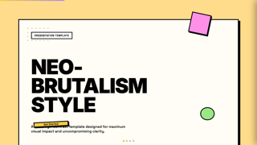</a><br>**Block Frame**<br>brutalism · light | <a href="presets/bold-poster/template.html">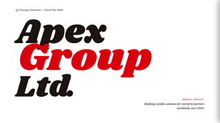</a><br>**Bold Poster**<br>bold-poster · light | <a href="presets/bold-signal/template.html">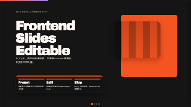</a><br>**Bold Signal**<br>dark |

### Editorial & Elegant

| | | |
|---|---|---|
| <a href="presets/dark-botanical/template.html">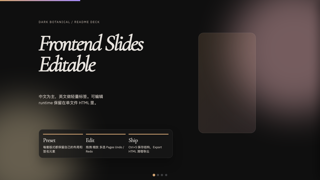</a><br>**Dark Botanical**<br>editorial · dark | <a href="presets/notebook-tabs/template.html">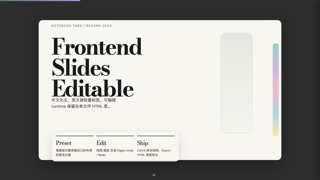</a><br>**Notebook Tabs**<br>editorial · light | <a href="presets/paper-and-ink/template.html">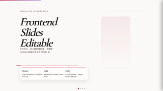</a><br>**Paper & Ink**<br>editorial · light |
| <a href="presets/vintage-editorial/template.html">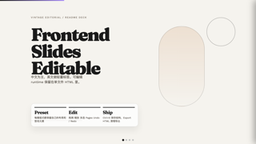</a><br>**Vintage Editorial**<br>editorial · light | | |

### Playful & Pastel

| | | |
|---|---|---|
| <a href="presets/pastel-geometry/template.html">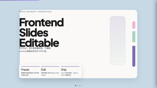</a><br>**Pastel Geometry**<br>playful · light | <a href="presets/split-pastel/template.html">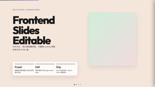</a><br>**Split Pastel**<br>playful · light | <a href="presets/scatterbrain/template.html">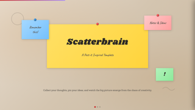</a><br>**Scatterbrain**<br>handwriting · light |

### Retro & Specialty

| | | |
|---|---|---|
| <a href="presets/retro-windows/template.html">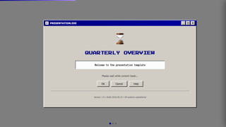</a><br>**Retro Windows**<br>retro-pixel · light | <a href="presets/neon-cyber/template.html">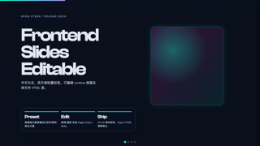</a><br>**Neon Cyber**<br>specialty · dark | <a href="presets/terminal-green/template.html">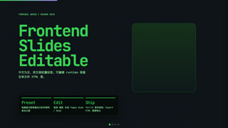</a><br>**Terminal Green**<br>specialty · dark |
| <a href="presets/creative-voltage/template.html">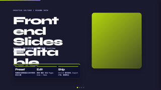</a><br>**Creative Voltage**<br>specialty · dark | | |

### Minimal & Clean

| | | |
|---|---|---|
| <a href="presets/monochrome/template.html">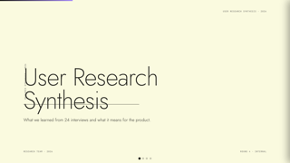</a><br>**Monochrome**<br>minimal · light | <a href="presets/swiss-modern/template.html">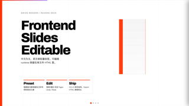</a><br>**Swiss Modern**<br>specialty · light | <a href="presets/electric-studio/template.html">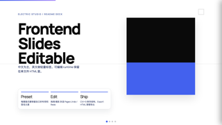</a><br>**Electric Studio**<br>light |

## Structure

```
editable-slide-templates/
├── presets/                  ← one folder per template
│   └── <preset-id>/
│       ├── preset.md         ← vibe / layout / typography / colors / signature
│       ├── template.html     ← working sample with full editable runtime
│       ├── screenshot.png    ← 1280×720 hero
│       ├── thumb.png         ← 320×180 list thumbnail
│       └── meta.json         ← machine-readable metadata (see schema.json)
├── runtime/                  ← shared runtime snapshot used by porting tools
│   ├── chrome.css            ← deck UI styles
│   ├── chrome.html           ← sidebar, edit toggle, RTE toolbar
│   ├── runtime.js            ← editor JS (history, deck, object editor, sidebar, persistence, export)
│   └── viewport-base.css     ← mandatory base CSS
├── scripts/
│   ├── port_to_editable.py       ← convert external templates to editable runtime
│   ├── migrate_from_skill.py     ← swap runtime in skill-sourced preset HTMLs
│   ├── snapshot_screenshots.py   ← capture screenshot.png + thumb.png via Chrome
│   └── generate_index.py         ← scan presets/ and emit INDEX.json
├── docs/
│   ├── porting-guide.md      ← how to adapt an external template (incl. pitfalls)
│   ├── contributing.md       ← preset submission rules
│   └── schema-versioning.md  ← schema evolution policy
├── ATTRIBUTIONS.md           ← original sources & licenses for ported templates
├── INDEX.json                ← generated index of all presets
└── schema.json               ← JSON Schema for meta.json (schemaVersion 1)
```

## Using a preset

For a one-off deck:

```bash
cp presets/bold-poster/template.html ~/my-deck.html
open ~/my-deck.html
# press `E` to enter edit mode
# Pages sidebar → Export PDF when done
```

For programmatic use (skill integration, gallery rendering): read `INDEX.json` for the preset list and `presets/<id>/meta.json` for individual metadata.

## Schema version

Current: **v1**. See [docs/schema-versioning.md](docs/schema-versioning.md). Run `python3 scripts/generate_index.py` after edits to refresh `INDEX.json`.

## Adding a preset

1. Pick a unique `id` (kebab-case).
2. Create `presets/<id>/` with `template.html`, `preset.md`, `meta.json`.
3. Validate `meta.json` against [schema.json](schema.json).
4. Run `python3 scripts/snapshot_screenshots.py --preset <id>` to capture images.
5. Add a row to [ATTRIBUTIONS.md](ATTRIBUTIONS.md) if derived from an external source.
6. Run `python3 scripts/generate_index.py` to refresh `INDEX.json`.

## License

MIT — see [LICENSE](LICENSE). Templates derived from external MIT-licensed sources are credited in [ATTRIBUTIONS.md](ATTRIBUTIONS.md).
