# Editable Slide Templates

Visual templates for the [`frontend-slides-editable`](https://github.com/dora-dotcom/frontend-slides-editable) skill. Every template ships as a single self-contained HTML file with the full editable deck runtime — drag/resize objects, multi-select, undo/redo, Pages sidebar, save to localStorage, export HTML, export PDF.

## Gallery — 40 presets

> Each thumbnail links to the template HTML. Open in a browser, press `E` to enter edit mode.

### Brutalism

| |  |  | 
|---|---|---|
| <a href="presets/block-frame/template.html"></a><br><strong>Block Frame</strong><br>bold, experimental · light | <a href="presets/neo-grid-bold/template.html">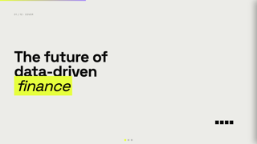</a><br><strong>Neo-Grid Bold</strong><br>bold, editorial · light | <a href="presets/raw-grid/template.html">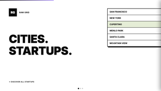</a><br><strong>Raw Grid</strong><br>bold, experimental · light |

### Bold & Poster

| |  |  | 
|---|---|---|
| <a href="presets/biennale-yellow/template.html">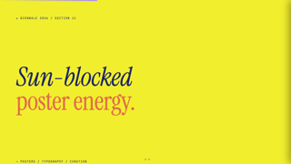</a><br><strong>Biennale Yellow</strong><br>bold, editorial · light | <a href="presets/bold-poster/template.html"></a><br><strong>Bold Poster</strong><br>bold, editorial · light | <a href="presets/broadside/template.html">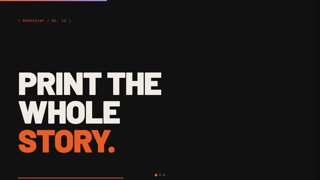</a><br><strong>Broadside</strong><br>bold, editorial · dark |
| <a href="presets/coral/template.html">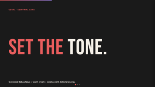</a><br><strong>Coral</strong><br>bold, editorial · dark | <a href="presets/pink-script/template.html">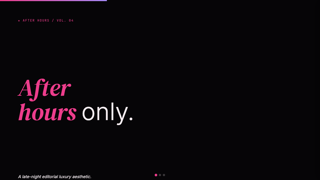</a><br><strong>Pink Script</strong><br>bold, elegant · dark | <a href="presets/studio/template.html">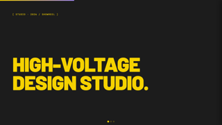</a><br><strong>Studio</strong><br>bold, professional · dark |

### Editorial

| |  |  | 
|---|---|---|
| <a href="presets/cartesian/template.html">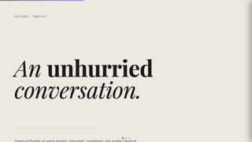</a><br><strong>Cartesian</strong><br>editorial, elegant · light | <a href="presets/cobalt-grid/template.html">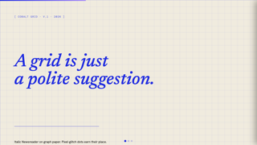</a><br><strong>Cobalt Grid</strong><br>editorial, futuristic · light | <a href="presets/dark-botanical/template.html"></a><br><strong>Dark Botanical</strong><br>elegant, editorial · dark |
| <a href="presets/editorial-forest/template.html">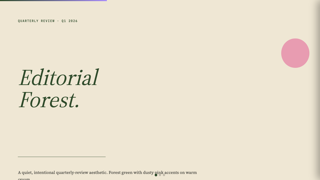</a><br><strong>Editorial Forest</strong><br>editorial, elegant · light | <a href="presets/editorial-tri-tone/template.html">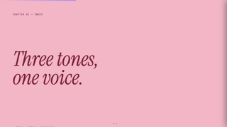</a><br><strong>Editorial Tri-Tone</strong><br>editorial, warm · light | <a href="presets/long-table/template.html">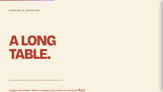</a><br><strong>Long Table</strong><br>editorial, warm · light |
| <a href="presets/notebook-tabs/template.html"></a><br><strong>Notebook Tabs</strong><br>editorial, elegant · light | <a href="presets/paper-and-ink/template.html"></a><br><strong>Paper & Ink</strong><br>editorial, elegant · light | <a href="presets/vintage-editorial/template.html"></a><br><strong>Vintage Editorial</strong><br>editorial, warm · light |

### Mid-Century & Calm

| |  |  | 
|---|---|---|
| <a href="presets/grove/template.html">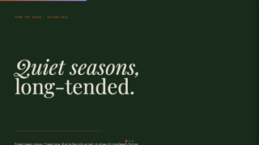</a><br><strong>Grove</strong><br>editorial, calm · dark | <a href="presets/mat/template.html">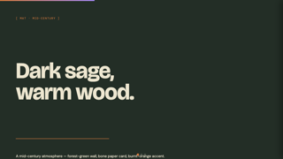</a><br><strong>Mat</strong><br>editorial, warm · dark |  |

### Minimal

| |  |  | 
|---|---|---|
| <a href="presets/monochrome/template.html"></a><br><strong>Monochrome</strong><br>minimal, academic · light | <a href="presets/stencil-tablet/template.html">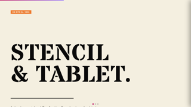</a><br><strong>Stencil & Tablet</strong><br>editorial, minimal · light |  |

### Modular

| |  |  | 
|---|---|---|
| <a href="presets/capsule/template.html">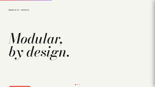</a><br><strong>Capsule</strong><br>modular, playful · light |  |  |

### Playful

| |  |  | 
|---|---|---|
| <a href="presets/daisy-days/template.html">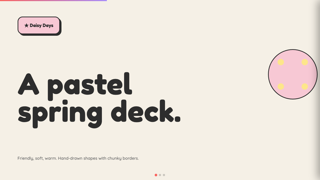</a><br><strong>Daisy Days</strong><br>playful, warm · light | <a href="presets/pastel-geometry/template.html"></a><br><strong>Pastel Geometry</strong><br>clean, playful · light | <a href="presets/playful/template.html">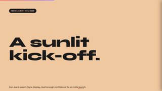</a><br><strong>Playful</strong><br>playful, warm · light |
| <a href="presets/split-pastel/template.html"></a><br><strong>Split Pastel</strong><br>playful, warm · light |  |  |

### Handwriting & Paper

| |  |  | 
|---|---|---|
| <a href="presets/pin-and-paper/template.html">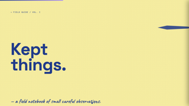</a><br><strong>Pin & Paper</strong><br>editorial, handwritten · light | <a href="presets/scatterbrain/template.html"></a><br><strong>Scatterbrain</strong><br>playful, handwritten · light |  |

### Retro & Pixel

| |  |  | 
|---|---|---|
| <a href="presets/8-bit-orbit/template.html">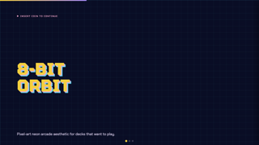</a><br><strong>8-Bit Orbit</strong><br>retro, futuristic · dark | <a href="presets/retro-windows/template.html"></a><br><strong>Retro Windows</strong><br>retro, playful · light |  |

### Retro Zine

| |  |  | 
|---|---|---|
| <a href="presets/retro-zine/template.html">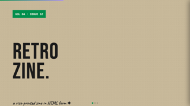</a><br><strong>Retro Zine</strong><br>retro, editorial · light | <a href="presets/sakura-chroma/template.html">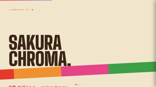</a><br><strong>Sakura Chroma</strong><br>retro, editorial · light |  |

### Activist

| |  |  | 
|---|---|---|
| <a href="presets/peoples-platform/template.html">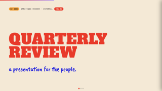</a><br><strong>People's Platform</strong><br>bold, activist · light |  |  |

### Dark

| |  |  | 
|---|---|---|
| <a href="presets/bold-signal/template.html"></a><br><strong>Bold Signal</strong><br>bold, professional · dark |  |  |

### Light

| |  |  | 
|---|---|---|
| <a href="presets/electric-studio/template.html"></a><br><strong>Electric Studio</strong><br>clean, professional · light |  |  |

### Specialty

| |  |  | 
|---|---|---|
| <a href="presets/creative-voltage/template.html"></a><br><strong>Creative Voltage</strong><br>bold, experimental · dark | <a href="presets/neon-cyber/template.html"></a><br><strong>Neon Cyber</strong><br>futuristic, experimental · dark | <a href="presets/swiss-modern/template.html"></a><br><strong>Swiss Modern</strong><br>clean, minimal · light |
| <a href="presets/terminal-green/template.html"></a><br><strong>Terminal Green</strong><br>minimal, futuristic · dark |  |  |

## Structure

```
editable-slide-templates/
├── presets/                  ← one folder per template
│   └── <preset-id>/
│       ├── preset.md         ← vibe / layout / typography / colors / signature
│       ├── template.html     ← working sample with full editable runtime
│       ├── screenshot.png    ← 1280×720 hero
│       ├── thumb.png         ← 320×180 list thumbnail
│       └── meta.json         ← machine-readable metadata (see schema.json)
├── runtime/                  ← shared runtime snapshot used by porting tools
│   ├── chrome.css            ← deck UI styles
│   ├── chrome.html           ← sidebar, edit toggle, RTE toolbar
│   ├── runtime.js            ← editor JS (history, deck, object editor, sidebar, persistence, export)
│   └── viewport-base.css     ← mandatory base CSS
├── scripts/
│   ├── port_to_editable.py       ← convert external templates to editable runtime
│   ├── migrate_from_skill.py     ← swap runtime in skill-sourced preset HTMLs
│   ├── snapshot_screenshots.py   ← capture screenshot.png + thumb.png via Chrome
│   └── generate_index.py         ← scan presets/ and emit INDEX.json
├── docs/
│   ├── porting-guide.md      ← how to adapt an external template (incl. pitfalls)
│   ├── contributing.md       ← preset submission rules
│   └── schema-versioning.md  ← schema evolution policy
├── ATTRIBUTIONS.md           ← original sources & licenses for ported templates
├── INDEX.json                ← generated index of all presets
└── schema.json               ← JSON Schema for meta.json (schemaVersion 1)
```

## Using a preset

For a one-off deck:

```bash
cp presets/bold-poster/template.html ~/my-deck.html
open ~/my-deck.html
# press `E` to enter edit mode
# Pages sidebar → Export PDF when done
```

For programmatic use (skill integration, gallery rendering): read `INDEX.json` for the preset list and `presets/<id>/meta.json` for individual metadata.

## Schema version

Current: **v1**. See [docs/schema-versioning.md](docs/schema-versioning.md). Run `python3 scripts/generate_index.py` after edits to refresh `INDEX.json`.

## Adding a preset

1. Pick a unique `id` (kebab-case).
2. Create `presets/<id>/` with `template.html`, `preset.md`, `meta.json`.
3. Validate `meta.json` against [schema.json](schema.json).
4. Run `python3 scripts/snapshot_screenshots.py --preset <id>` to capture images.
5. Add a row to [ATTRIBUTIONS.md](ATTRIBUTIONS.md) if derived from an external source.
6. Run `python3 scripts/generate_index.py` to refresh `INDEX.json`.

## License

MIT — see [LICENSE](LICENSE). Templates derived from external MIT-licensed sources are credited in [ATTRIBUTIONS.md](ATTRIBUTIONS.md).
